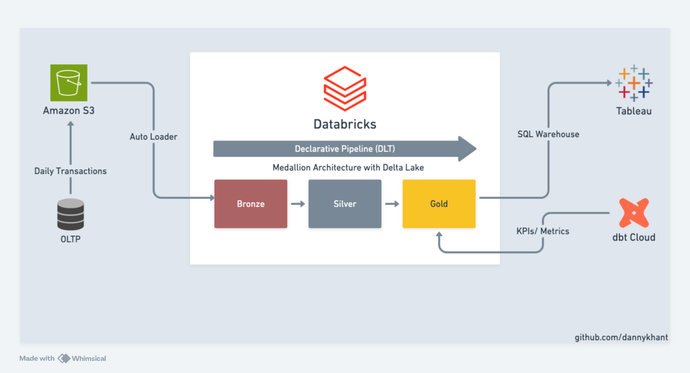

# Data Pipeline Specification

## 1. Overview
- **Pipeline Name**: `ecomm_data_pipeline`
- **Description**: Data pipeline for ecommerce data analytics of {company_name}
- **Objective**: Ingest OLTP data into S3, process through Databricks DLT (Bronze/Silver/Gold), use dbt to define aggregate metrics, and expose results to Tableau dashboards.
- **Frequency**: Daily batch (01:00 ICT)

## 2. Data Sources
| Source       | Type        | Location         | Description         |
|--------------|-------------|-----------------|----------------------|
| `orders`     | PostgreSQL  | RDS: `ecomm-db` | Sales orders         |
| `products`   | PostgreSQL  | RDS: `ecomm-db` | Product catalog      |
| `customers`  | PostgreSQL  | RDS: `ecomm-db` | Customer profiles    |
| `order_items`| PostgreSQL  | RDS: `ecomm-db` | Order items details  |

## 3. Data Landing Zone (Raw)
- **Destination**: `s3://{bucket-name}/ecomm_db_extracts/daily_extracts`
- **Format**: CSV
- **Partitioning**: `ingestion_date=YYYY-MM-DD`
- **Method**: Incremental extract via `updated_at`
- **Tool**: Airflow DAG → PythonOperator

## 4. Transformation Pipeline (Databricks DLT)
- **Catalog**: `ecomm_dw`

### Bronze Layer
- **Schema**: `bronze`
- Raw ingestion from S3
- Schema evolution mode: rescue

### Silver Layer
- **Schema**: `silver`
- Cast column type into proper type
- Add data processed timestamp
- Add quality check on primary keys
- Fact & dimension models:
  - `fact_orders` (orders + order_items + customer + product)
  - `dim_orders` (order details info)
  - `dim_customer` (clean customer profile)
  - `dim_product` (product details info)

### Gold Layer
- **Schema**: `gold`
- Analytics & agg models:
  - `sales_analytics` (analytics obt for data serving)
  - `agg_daily_sales` (daily sales aggregation)

## 5. Semantic Layer (dbt — Metrics Only)
- **dbt Schema**: `dbt_prod_metric`
- **Purpose**: Business aggregations on top of Gold tables
- **Models**:
  - `agg_sales_kpi`: `SUM(item_price), COUNT(distinct order_id)` by order_date
  - `agg_product_kpi`: `SUM(quantity)` by order_date, product, category
  - `agg_customer_kpi`: `COUNT(1)` by order_date
- **dbt Tests**:
  - Ensure source columns not null

## 6. Consumption Layer (Tableau)
- **Connection**: Tableau → Databricks SQL Warehouse
- **Datasets Exposed**: dbt metrics tables
- **Dashboards**:
  - Ecommerce Analytics Dashboard (Revenue, AOV, Top Selling Categories, Customer Acquisition)
- **Refresh**: Extract refresh after dbt job completes

## 7. Orchestration
- **Delarative Pipeline**: `batch_ecomm_pipeline`
    - **Tasks**:
        1. Bronze with Autoloader
        2. Silver star schema
        3. Gold analytics & agg models
    - **Schedule**:
        - 0 1 * * * (ICT)
- **dbt Job**: `DailyRefresh`
    - **Tasks**:
        1. Regenerate daily agg models
    - **Schedule**:
        - 0 5 * * * (ICT)

## 8. Data Quality
- **DLT Expectations**: valid id, valid status (`'shipped', 'delivered', 'cancelled', 'pending'`), valid price (>= 0)
- **dbt Tests**: source checks (not null)

## 9. Monitoring
- **DLT**: built-in pipeline logs & notification on pipeline failure
- **dbt**: artifacts + run results in dbt Cloud

## 10. Security
- **Raw (S3)**: DE-only access
- **Silver/Gold**: Unity Catalog RBAC
- **Metrics**: Tableau consumers access only to dbt metric tables
